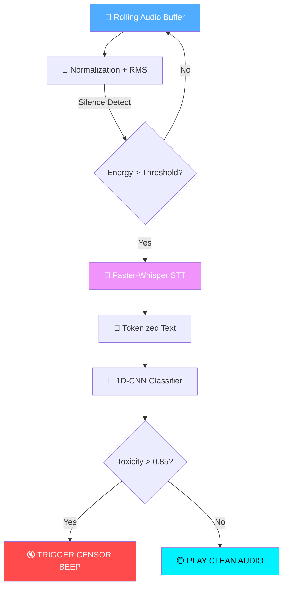

<div align="center">

# 🎙️ Beep-for-Abuse — Real-Time Toxic Audio Interceptor

[](https://git.io/typing-svg)

<br/>

[](https://beep-for-abuse-project.streamlit.app/)
[](https://mayank-goyal09.github.io/)

<br/>


<br/>

[](https://github.com/mayank-goyal09/beep-for-abuse/stargazers)
[](https://github.com/mayank-goyal09/beep-for-abuse/network)

<br/>

### 🧱 **Engineering a high-speed "Digital Bouncer" to intercept hate speech before it lands.** 

### 🎧⚡ **From Raw Audio Stream → Instant Censor Beep** 🎧⚡

</div>

---

## 🛡️ **THE INTERCEPTOR AT A GLANCE**

<table>
<tr>
<td width="50%">

### 🎯 **What This Project Does**

This system functions as a **Real-Time Toxic Audio Interceptor** for gaming and voice environments. It listens to live microphone input in 1-second windows, transcribes speech using a "bare-metal" optimized Whisper engine, and classifies toxicity using a custom **1D-CNN**.

**The "Digital Bouncer" Pipeline:**
- 🎤 **Audio Streamer** → captures rolling 1s buffers.
- 🌊 **Normalization** → balances input for clear AI "hearing."
- 🧠 **Faster-Whisper** → Audio-to-Text via Int8 quantization.
- 🥊 **1D-CNN Classifier** → detects hate speech/harassment.
- 🔇 **Audio Gate** → triggers a "Censor Beep" instantly.

</td>
<td width="50%">

### ✨ **Key Highlights**

| Feature | Details |
|---------|---------|
| ⏱️ **Latency** | Near real-time (<2s end-to-end) |
| 🛡️ **Model Type** | 1D-CNN Text Classifier |
| 🎤 **STT Engine** | Faster-Whisper (CTranslate2) |
| 🎚️ **Sensitivity** | Dynamic thresholds in `config.yaml` |
| 🔇 **Action** | Instant Censor Beep / Clean Passthrough |
| ⚡ **Optimization** | Int8 Quantization & Silence Skipping |
| 🎨 **Feedback** | Terminal-based live logging & audio cues |

</td>
</tr>
</table>

---

## 🛠️ **TECHNOLOGY STACK**

<div align="center">


</div>

| **Category** | **Technologies** | **Purpose** |
|:------------:|:-----------------|:------------|
| 🐍 **Core Language** | Python 3.8+ | System orchestration & logic |
| 🧠 **Speech-to-Text** | Faster-Whisper | Optimized STT (CTranslate2) |
| 🥊 **Classification** | TensorFlow / Keras | 1D-CNN Hate Speech detection |
| 🎧 **Audio IO** | Sounddevice / Scipy | Mic input capture & output routing |
| 📊 **Numerical Ops** | NumPy / Pandas | Signal processing & data handling |
| ⚙️ **Config** | PyYAML | External system tuning |

---

## 🔬 **THE MULTI-STAGE BRAIN ARCHITECTURE**



### **System Breakdown:**

<table>
<tr>
<td>

#### 🏃 **1. Bare-Metal Performance**
Optimized for concurrent 3D gaming environments. Uses **Int8 Quantization** and **CTranslate2** to shift the heavy lifting from the CPU to the bare-metal, ensuring minimal impact on game FPS.

</td>
<td>

#### 🎯 **2. 1D-CNN Precision**
Unlike simple keyword filters, our **1D-CNN Classifier** understands context. It uses a custom-trained embedding layer to identify complex hate speech patterns that standard filters miss.

</td>
</tr>
<tr>
<td>

#### 🌊 **3. Signal Normalization**
Raw mic inputs are often erratic. The **Audio Streamer** normalizes amplitude and calculates RMS energy to skip silence, ensuring the AI only works on clear, audible speech.

</td>
<td>

#### 🔇 **4. The Audio Gate**
The **AudioGate Controller** manages the final output. If toxicity is detected, it intercepts the voice packet and injects a standard censor tone, shielding listeners from abuse.

</td>
</tr>
</table>

---

## 📂 **PROJECT STRUCTURE**

```
🎙️ beep-for-abuse/
│
├── 🚀 main.py                  # Entry point: The Digital Bouncer engine
├── ⚙️ config.yaml               # System sensitivity & paths
├── 📦 requirements.txt         # Core dependencies
│
├── 🧠 src/                      # The Modular Brain
│   ├── audio_buffer.py         # Capture & Normalization
│   ├── translator.py           # Faster-Whisper implementation
│   ├── classifier.py           # 1D-CNN Inference logic
│   └── gate_controller.py      # Audio Interceptor & Beeper
│
├── 🗂️ assets/                   # Heavyweight Assets
│   └── models/
│       ├── toxic_cnn.h5        # Trained Keras Model
│       └── tokenizer.pickle    # NLP Preprocessing
│
└── 📖 README.md                # You are here! 🎉
```

---


## 🚀 **QUICK START GUIDE**

### **Step 1: Clone the Repository** 📥

```bash
git clone https://github.com/mayank-goyal09/beep-for-abuse.git
cd beep-for-abuse
```

### **Step 2: Install Optimized Dependencies** 📦

```bash
pip install -r requirements.txt
```

### **Step 3: Setup Models** 🧠
Ensure your trained model files (`toxic_cnn.h5` & `tokenizer.pickle`) are placed in `assets/models/`.

### **Step 4: Launch the Bouncer** 🛡️

```bash
python main.py
```

> 🎉 **Status: Online!** Start speaking into your mic. Toxic phrases will trigger the audio gate, while clean speech will pass through.

---

## 🔮 **FUTURE ENHANCEMENTS**

- [ ] 🎧 **Virtual Audio Cable Integration**: Direct routing into Discord/In-game chat.
- [ ] 🗣️ **Multilingual Support**: Real-time translation for global toxicity detection.
- [ ] 📊 **Dashboard View**: Streamlit UI to monitor toxicity trends.
- [ ] 💨 **Transformer Upgrade**: Swapping CNN for an Attention-based model.
- [ ] ⚙️ **GUI Control**: Desktop app for toggling sensitivity on the fly.

---

## 👨‍💻 **CONNECT WITH ME**

<div align="center">

[](https://github.com/mayank-goyal09)
[](https://www.linkedin.com/in/mayank-goyal-4b8756363/)
[](https://mayank-portfolio-delta.vercel.app/)

**Mayank Goyal**  
🧠 Deep Learning Enthusiast | 🎙️ Audio AI Engineer | 🐍 Python Developer  

---

### 🛡️ **Built with ❤️ by Mayank Goyal**
*"Intercepting abuse at the speed of sound."* ⚡🥊

</div>
